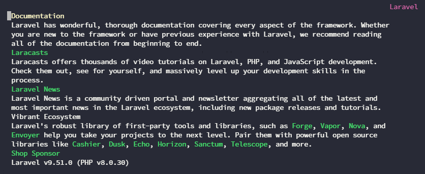
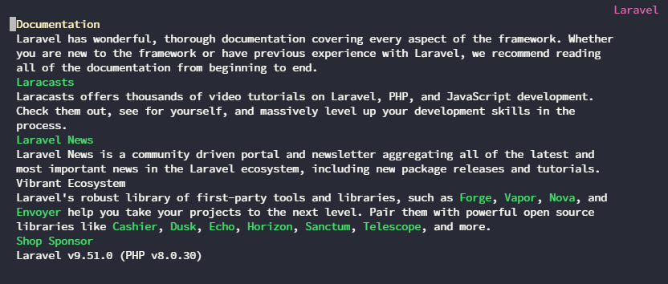
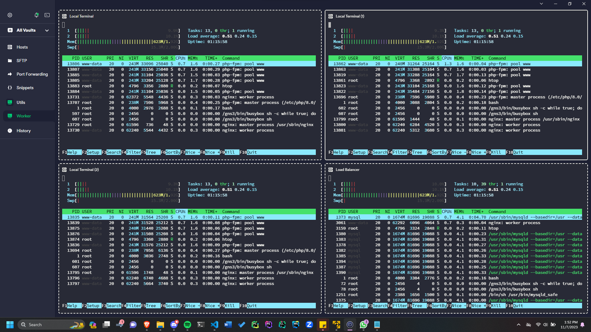

# Implementasi Load Balancer

Pada bagian ini akan dijelaskan implementasi Load Balancer dalam kehidupan sehari-hari. Jika pada modul 2 kita telah melakukan deployment aplikasi PHP pada Nginx, pada modul 3 ini kita akan melakukan deployment kerangka kerja Laravel pada Nginx Load Balancer.

## Persiapan

Untuk melakukan deployment aplikasi Laravel pada GNS3, tambahkan image docker `ervn-debi-new` pada GNS3 sesuai langkah yang tertera pada [Modul GNS3](https://github.com/lab-kcks/Modul-Komdat-Jarkom/tree/main/Modul-GNS3). Gunakan image tersebut untuk membuat topologi pada GNS3.

Kemudian buatlah topologi dan lakukan konfigurasi sebagai berikut:


### Melakukan Register Domain pada DNS Server

Lakukan instalasi bind9 sesuai dengan materi [Modul 2](https://github.com/lab-kcks/Modul-Komdat-Jarkom/tree/main/Modul-2/DNS), kemudian lakukan register domain `modul3.com` .

Tambahkan konfigurasi pada `/etc/bind/named.conf.local` sebagai berikut:

```sh
zone "modul3.com" {
        type master;
        file "/etc/bind/modul3/modul3.com";
};
```

Kemudian aturlah register domain pada file `/etc/bind/modul3.com` sebagai berikut:

```
$TTL    604800          ; Waktu cache default (detik)
@       IN      SOA     modul3.com. root.modul3.com. (
                        2025100401 ; Serial (format YYYYMMDDXX)
                        604800     ; Refresh (1 minggu)
                        86400      ; Retry (1 hari)
                        2419200    ; Expire (4 minggu)
                        604800 )   ; Negative Cache TTL
;

@       IN      NS      modul3.com.
@       IN      A       10.40.2.5
```

Lakukan uji coba ping DNS pada Client:


## Deployment

### Set Up Database pada Load Balancer

Selanjutnya, agar aplikasi Laravel yang kita buat terkoneksi dengan database, lakukan instalasi mysql-server pada Load Balancer dengan perintah berikut:

```sh
apt install mariadb-server -y
```

Kemudian nyalakan service mysql dengan perintah berikut

```sh
service mariadb start
```

Lakukan konfigurasi mysql sebagai berikut dengan yyy merupakan kode kelompok:
```sh
mariadb
```
Lalu masukkan query seperti dibawah
```sql
CREATE USER 'kelompokyyy'@'%' IDENTIFIED BY 'passwordyyy';
CREATE USER 'kelompokyyy'@'localhost' IDENTIFIED BY 'passwordyyy';
CREATE DATABASE dbkelompokyyy;
GRANT ALL PRIVILEGES ON *.* TO 'kelompokyyy'@'%';
GRANT ALL PRIVILEGES ON *.* TO 'kelompokyyy'@'localhost';
FLUSH PRIVILEGES;
```

Lakukan akses database dengan menggunakan user yang sudah dibuat kemudian gunakan perintah `SHOW DATABASES;` untuk mengetahui apakah database telah berhasil dibuat:


Karena database akan diakses oleh tiga worker, tambahkan konfigurasi berikut pada `/etc/mysql/my.cnf`, jangan lupa untuk merestart service setelahnya.

```
[mysqld]
skip-networking=0
skip-bind-address
```
```sh
service mariadb restart
```

Untuk mengecek apakah database sudah dapat diakses melalui Worker, lakukan instalasi mariadb-client pada Worker1 sebagai berikut:

```sh
apt install mariadb-client -y
```

Kemudian lakukan koneksi pada database dengan perintah berikut:

```sh
mariadb --host=10.40.2.5 --port=3306 --user=kelompokyyy --password
```

Hasilnya adalah sebagai berikut:


### Melakukan Konfigurasi pada Worker

Deployment akan dilakukan pada masing-masing worker. Untuk melakukan deployment, langkah-langkah yang harus dilakukan adalah:

1. Instalasi Package yang Diperlukan

    Pertama, lakukan update package-list dengan command:
    
    ```sh
    apt update
    ```

    Lakukan instalasi package yang diperlukan untuk menambahkan repository PHP.

    ```sh
    apt install -y lsb-release apt-transport-https ca-certificates wget
    ```

    Unduh dan tambahkan Sury GPG-key:
    
    ```sh
    wget -O /etc/apt/trusted.gpg.d/php.gpg https://packages.sury.org/php/apt.gpg
    ```

   
   Tambahkan Repository Sury ke sources list
    ```sh
    echo "deb https://packages.sury.org/php/ $(lsb_release -sc) main" | tee /etc/apt/sources.list.d/php.list
    ```

    Perintah di atas akan menambahkan repository PHP sesuai dengan distro sistem yang digunakan kemudian menuliskannya pada file `php.list`

    Kemudian lakukan update repositori dengan perintah
    ```
    apt update
    ```

    Setelah itu lakukan instalasi PHP dengan perintah berikut:
    
    ```sh
    apt install php8.0-mbstring php8.0-xml php8.0-cli php8.0-common php8.0-intl php8.0-opcache php8.0-readline php8.0-mysql php8.0-fpm php8.0-curl unzip wget -y
    ```

    Lakukan pengecekan versi php dengan mengetikkan `php --version`.

    Kemudian, setelah php berhasil diinstall, install nginx yang akan digunakan sebagai webserver
    ```
    apt install nginx -y
    ```

2. Lakukan instalasi composer 2

    Composer 2 merupakan package manager untuk PHP. Untuk melakukan instalasi dapat dilakukan dengan langkah berikut:

    ```sh
    wget https://getcomposer.org/download/2.0.13/composer.phar
    chmod +x composer.phar
    mv composer.phar /usr/bin/composer
    ```

    Kemudian lakukan pengecekan versi composer dengan `composer -V` sebagai berikut:
   

3. Lakukan persiapan pada web yang akan dideploy
    
    Lakukan instalasi git dengan perintah berikut:
    
    ```sh
    apt install git -y
    ```
    
    Kemudian clone repository yang akan dideploy pada direktori `/var/www`
    
    ```sh
    git clone https://github.com/elshiraphine/laravel-simple-rest-api.git
    ```
    
    Setelah itu, install vendor dengan perintah berikut pada direktori laravel-simple-rest-api
    
    ```sh
    composer install
    ```

    Setelah package (vendor) terinstall, maka akan muncul seperti berikut:
    
    

    Kemudian copy `.env.example` menjadi `.env` dan ubah konfigurasi database sesuai dengan kredensial yang sudah dibuat di atas.

   
    Setelah env selesai diset, jalankan perintah berikut pada Worker 1:

    ```
    php artisan migrate:fresh
    php artisan db:seed --class=AiringsTableSeeder
    ```

    Perintah di atas akan melakukan migrasi tabel dari Laravel ke Database dan akan melakukan seed data pada class AiringTableSeeder ke database.

    Lakukan pengecekan pada database sebagai berikut:


   


   

    Terakhir, generate key pada project laravel dengan perintah berikut:
    ```
    php artisan key:generate
    ```

5. Deployment pada Worker

    Untuk melakukan deployment pada masing-masing worker, tambahkan virtual host seperti langkah-langkah pada [modul 2](https://github.com/lab-kcks/Modul-Komdat-Jarkom/blob/main/Modul-2/Reverse%20Proxy/README.md#362-contoh-implementasi-pada-arsitektur-kita) sebagai berikut pada file `/etc/nginx/sites-available/modul3.com`.

    ```
    server {

        listen [SPECIFIC-PORT];

        root /var/www/laravel-simple-rest-api/public;

        index index.php index.html index.htm;
        server_name _;

        location / {
                try_files $uri $uri/ /index.php?$query_string;
        }

        # pass PHP scripts to FastCGI server
        location ~ \.php$ {
        include snippets/fastcgi-php.conf;
        fastcgi_pass unix:/var/run/php/php8.0-fpm.sock;
        }

    location ~ /\.ht {
                deny all;
        }

        error_log /var/log/nginx/modul3_error.log;
        access_log /var/log/nginx/modul3_access.log;
    }
    ```

    Atur port untuk masing-masing worker sebagai berikut:
    - Worker1 = 8001
    - Worker2 = 8002
    - Worker3 = 8003

    Setelah selesai, buat symlink untuk melakukan enable pada site dengan perintah:
    ```
    ln -s /etc/nginx/sites-available/modul3 /etc/nginx/sites-enabled/
    ```

    Kemudian, untuk memastikan bahwa server web (diasumsikan berjalan sebagai www-data) memiliki izin yang diperlukan untuk mengelola dan mengakses direktori penyimpanan maka jalankan perintah berikut:

    ```
    chown -R www-data:www-data /var/www/laravel-simple-rest-api/storage
    ```

    Jalankan service php-fpm dengan perintah berikut:
    ```
    service php8.0-fpm start
    ```

    Setelah semua perintah dijalankan, lakukan testing dengan menggunakan lynx hingga muncul halaman berikut:

    

    Kemudian, karena aplikasi tersebut merupakan Restful API, cobalah melakukan testing dengan curl sebagai berikut:

    

### Melakukan Konfigurasi Load Balancer

Load balancer pada modul implementasi ini tidak jaduh berbeda dengan modul-modul sebelumnya. Untuk membuat konfigurasi load balancer, lakukan instalasi nginx pada LoadBalancer:

```sh
apt install nginx -y
```

Kemudian, untuk konfigurasi load balancer akan menggunakan algoritma Round-Robin secara default, sehingga konfigurasinya adalah sebagai berikut:

```sh
upstream laravel {
        server 10.0.2.2:8001;
        server 10.0.2.3:8002;
        server 10.0.2.4:8003;
}

server {
        listen 80;
        server_name modul3.com;

        location / {
                proxy_pass http://laravel;
        }
}
```

Jangan lupa untuk membuat symlink dan melakukan restart pada service nginx.

Untuk melakukan testing, buka halaman `modul3.com` pada client dengan menggunakan lynx dan curl sehingga hasilnya adalah sebagai berikut:



 

## Load Testing

Untuk melakukan testing, lakukan instalasi Apache Benchmark sesuai pada [modul instalasi Apache Benchmark](https://github.com/arsitektur-jaringan-komputer/Modul-Jarkom/tree/master/Modul-3/Reverse%20Proxy#231-apache-benchmark).

Kemudian lakukan testing pada endpoint `/api/airing/` sebagai berikut:

```sh
ab -n 100 -c 10 modul3.com/api/airing/
```

Hasilnya adalah sebagai berikut:



```
This is ApacheBench, Version 2.3 <$Revision: 1843412 $>
Copyright 1996 Adam Twiss, Zeus Technology Ltd, http://www.zeustech.net/
Licensed to The Apache Software Foundation, http://www.apache.org/

Benchmarking modul3.com (be patient).....done


Server Software:        nginx/1.14.2
Server Hostname:        modul3.com
Server Port:            80

Document Path:          /api/airing/
Document Length:        814 bytes

Concurrency Level:      10
Time taken for tests:   110.934 seconds
Complete requests:      100
Failed requests:        0
Total transferred:      109700 bytes
HTML transferred:       81400 bytes
Requests per second:    0.90 [#/sec] (mean)
Time per request:       11093.406 [ms] (mean)
Time per request:       1109.341 [ms] (mean, across all concurrent requests)
Transfer rate:          0.97 [Kbytes/sec] received

Connection Times (ms)
              min  mean[+/-sd] median   max
Connect:        0    2   1.8      1       9
Processing:  5055 9689 1362.0  10066   10383
Waiting:     5055 9689 1362.0  10065   10383
Total:       5055 9690 1362.2  10067   10386

Percentage of the requests served within a certain time (ms)
  50%  10067
  66%  10090
  75%  10095
  80%  10110
  90%  10247
  95%  10266
  98%  10294
  99%  10386
 100%  10386 (longest request)
```

Kemudian naikkan banyaknya request dan concurrency menjadi:

```
ab -n 2000 -c 100 modul3.com/api/airing/
```

Hasilnya adalah sebagai berikut:

```
This is ApacheBench, Version 2.3 <$Revision: 1843412 $>
Copyright 1996 Adam Twiss, Zeus Technology Ltd, http://www.zeustech.net/
Licensed to The Apache Software Foundation, http://www.apache.org/

Benchmarking modul3.com (be patient)
Completed 200 requests
Completed 400 requests
Completed 600 requests
Completed 800 requests
Completed 1000 requests
Completed 1200 requests
Completed 1400 requests
Completed 1600 requests
Completed 1800 requests
Completed 2000 requests
Finished 2000 requests


Server Software:        nginx/1.14.2
Server Hostname:        modul3.com
Server Port:            80

Document Path:          /api/airing/
Document Length:        814 bytes

Concurrency Level:      100
Time taken for tests:   141.755 seconds
Complete requests:      2000
Failed requests:        1921
   (Connect: 0, Receive: 0, Length: 1921, Exceptions: 0)
Non-2xx responses:      1919
Total transferred:      710578 bytes
HTML transferred:       396453 bytes
Requests per second:    14.11 [#/sec] (mean)
Time per request:       7087.772 [ms] (mean)
Time per request:       70.878 [ms] (mean, across all concurrent requests)
Transfer rate:          4.90 [Kbytes/sec] received

Connection Times (ms)
              min  mean[+/-sd] median   max
Connect:        0    5   8.1      3      51
Processing:     1 5023 17245.5      3  120085
Waiting:        0 4963 17158.2      3  120085
Total:          1 5028 17249.5      6  120123

Percentage of the requests served within a certain time (ms)
  50%      6
  66%      7
  75%      8
  80%      9
  90%     58
  95%  60002
  98%  60016
  99%  60101
 100%  120123 (longest request)
```

Dari hasil testing di atas, terdapat informasi bahwa terjadi 1921 request yang gagal. Untuk mengetahui errornya, kita dapat melakukan cat pada `/var/log/nginx/error.log`, hasilnya adalah sebagai berikut:

```
2023/11/07 05:57:52 [error] 3061#3061: *825 no live upstreams while connecting to upstream, client: 10.0.1.2, server: modul3.com, request: "GET /api/airing/ HTTP/1.0", upstream: "http://laravel/api/airing/", host: "modul3.com"
```

Error tersebut disebabkan oleh upstream membutuhkan waktu terlalu lama untuk menjawab request dan NGINX menganggap upstream telah gagal dalam memproses permintaan tersebut.

