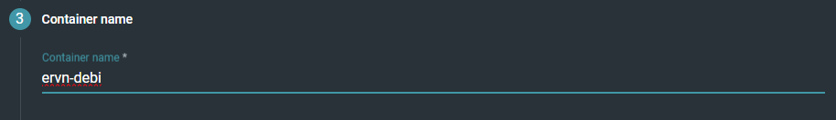
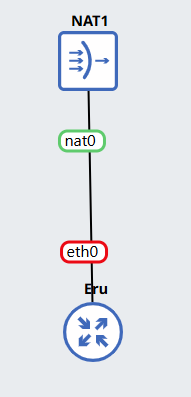

Modul Pengenalan GNS3
===============

- [Modul Pengenalan GNS3](#modul-pengenalan-gns3)
  - [Apakah GNS3 itu?](#apakah-gns3-itu)
  - [Instalasi GNS3 VM](#instalasi-gns3-vm)
    - [Import Image di VirtualBox](#import-image-di-virtualbox)
    - [Import Image di VMWare](#import-image-di-vmware)
    - [Memasukkan Image Ubuntu ke GNS3](#memasukkan-image-ubuntu-ke-gns3)
  - [Instalasi GNS3 Client](#instalasi-gns3-client)
    - [Download GNS3 Client](#instalasi-gns3-client)
    - [Setup GNS3 Client](#instalasi-gns3-client)
  - [Penggunaan GNS3 Web](#penggunaan-gns3-web)
    - [Setup IP di Node](#setup-ip-di-node)
    - [Akses Sebuah Node ke Internet](#akses-sebuah-node-ke-internet)
    - [Membuat Topologi](#membuat-topologi)
  - [Penggunaan GNS3 Client](#penggunaan-gns3-client)
    - [Setup IP di Node GNS3 Client](#setup-ip-di-node-gns3-client)
    - [Akses Sebuah Node ke Internet di Client](#akses-sebuah-node-ke-internet-di-client)
    - [Membuat Topologi di Client](#membuat-topologi-di-client)
  - [Ketentuan](#ketentuan)
  - [Peringatan, Saran, Tips, dan Trik](#peringatan-saran-tips-dan-trik)
  - [Troubleshooting](#troubleshooting)
  - [Sumber](#sumber)

## Apakah GNS3 itu?
**GNS3 (Graphical Network Simulator-3)** adalah alat yang membantu Anda untuk bisa menjalankan sebuah simulasi dari topologi kecil yang hanya terdiri dari beberapa alat saja di komputer Anda sampai dengan topologi yang memiliki banyak alat yang di-hosting di beberapa server.

## Instalasi GNS3 VM
### Import Image di VirtualBox
1. Install VirtualBox
Silahkan mendownload dari link berikut [VirtualBox 7.0](https://www.oracle.com/virtualization/technologies/vm/downloads/virtualbox-downloads.html).

2. Download Image VM GNS3
Silahkan mendowload dari link berikut [GNS3 VM 3.0.5](https://github.com/GNS3/gns3-gui/releases/download/v3.0.5/GNS3.VM.VirtualBox.3.0.5.zip). Sehabis itu langsung saja extract.

3. Import file .ova ke VirtualBox


4.  Membuat host network adapter baru
  - Pilih File Menu -> Host Network Manager <br/>

  - Klik Create <br/>

  - Lalu setting agar IPv4 Address adalah `192.168.0.1`, dan IPv4 Network Mask `255.255.255.0` lalu klik apply


5. Ubah Network Adapter di VM
  - Pergi ke Settings -> Network
  - Ubah Adapter 1 ke Host-only Adapter dan sesuaikan dengan host network yang telah dibuat sebelumnya

  - Dan ubah Adapter 2 menjadi NAT <br/>

  - Lalu klik OK

6.  Jalankan VM
  - Maka VM seharusnya bisa menampilkan ini

  - Lalu buka alamat dengan keterangan "To launch the Web-UI" di browser


Setelah itu silahkan lanjutkan untuk mengimpor image Ubuntu ke GNS3 [disini](#memasukkan-image-ubuntu-ke-gns3)


### Import Image di VMWare
1. Install VMWare
Silahkan mendownload dari [VMware Workstation 17](https://www.vmware.com/products/workstation-pro/workstation-pro-evaluation.html).

2. Download Image VM GNS3
Silahkan mendowload dari [GNS3 VM 3.0.5](https://github.com/GNS3/gns3-gui/releases/download/v3.0.5/GNS3.VM.VMware.Workstation.3.0.5.zip). Sehabis itu langsung saja extract.

3. Import file .ova ke VMWare dan namai VM.


4. Sesuaikan settingan VMWare dengan klik `Edit virtual machine settings`.
- Pastikan settingan Network sudah sesuai.


- Jika ada error `Virtualized ... Not Supported on Platform` saat vm nanti dijalankan, coba disable virtualisasi di settingan processor


5.  Jalankan VM
  - Maka VM seharusnya bisa menampilkan ini

  - Lalu buka alamat dengan keterangan "To launch the Web-UI" di browser


Setelah itu silahkan lanjutkan untuk mengimpor image Ubuntu ke GNS3 [disini](#memasukkan-image-ubuntu-ke-gns3)

### Memasukkan Image Ubuntu ke GNS3

1. Import image ubuntu
  - Klik `Open menu` pada kiri atas <br/>
    
  - Pilih `Template preferences` <br/>
    
  - Pilih `Docker` <br/>
    
  - Klik `Add Docker container template` <br/>
    
  - `Controller type` pilih `Run this Docker container locally` <br/>
     
  - Klik `Docker Virtual Machine`, pilih `New image` isikan `nevarre/gns3-debi:latest` di Image name <br/>
    
  - Klik `Container name` masukkan `ervn-debi` sebagai nama container <br/>
    
  - Klik `Network adapters` dan masukkan angka 4 <br/>
    
  - Biarkan bagian `Start command`, `Console type`, `Auxiliary console type`, dan `Environment`
  - Lalu klik tombol `Add template` di bawah sendiri <br/>
    

2. Coba image yang telah di-import
  - Klik `Open menu` di kiri atas <br/>
    
  - Pilih `Projects` <br/>
    
  - Klik `Add blank project` <br/>
    
  - Masukkan nama project (terserah)
  - Klik `Add project` <br/>
    
  - Klik tombol `Add a node` di atas <br/>
    
  - Lalu tarik `ervn-debi` ke area kosong di halaman <br/>
    
  - Tunggu sampai loading selesai
  - Jika berhasil akan menampilkan tampilan yang mirip dengan ini <br/>
    
  - Kita bisa start dengan klik kanan di node dan klik `Start` <br/>
    

3. Akses node
  - Bisa dilakukan dengan `Web console`  <br/>
    
  - Bisa dilakukan menggunakan command `telnet [IP VM] [Port node]` di terminal lokal pc kita, jika menggunakan contoh di gambar, maka commandnya adalah `telnet 10.15.43.32 5006` <br/>
    
  - Jika menggunakan telnet, hati-hati jika ingin keluar dari node. Gunakan `Ctrl + ]` lalu ketik quit untuk keluar dari node.
  - Jika command prompt tidak kunjung keluar, bisa klik enter berkali-kali sampai keluar

## Penggunaan GNS3 Web

### Setup IP di Node

1. Klik kanan pada node, buka `Configure` <br/>
   
2. Pada menu `General settings`, cari tombol `Edit network configuration` <br/>
   
3. Di situ kalian bisa setup IP sesuai dengan interface yang digunakan. Interface adalah sesuatu yang digunakan untuk menghubungkan dua device

### Akses Sebuah Node ke Internet
1. Buka menu Add a Node <br/>
   
2. Tarik NAT ke area kosong <br/>
  
3. Gunakan aktifkan menu `Add a Link` <br/>
  
4. Lalu klik node, pilih interface `eth0`, dan klik node NAT yang ditarik tadi <br/>
  
5. Lalu konfigurasi IP dari node ubuntu
  - Cari 2 line yang seperti ini
  ```
  # auto eth0
  # iface eth0 inet dhcp
  ```
  - Uncomment kedua line tersebut, lalu save
  ```
  auto eth0
  iface eth0 inet dhcp
  ```
6. Start node <br/>
   
7. Akses console dari node, dan coba ping ke google, jika berhasil maka settingan Anda benar <br/>
   
8. Node ini akan nanti digunakan sebagai router untuk modul ini, ganti nama node ini menjadi `Eru` dengan fitur `Change hostname` di node, dan juga ganti symbol ke simbol router dengan fitur `Change symbol`
   

### Membuat Topologi
1. Tambahkan beberapa node ethernet switch dan ubuntu, lalu buat hubungan antar node dan nama-nama dari node hingga seperti di gambar <br/>
  
2. Gunakan fitur `Change hostname` untuk merubah nama-nama dari node
3. Lalu kita setting network masing-masing node dengan fitur `Edit network configuration` seperti yang ditunjukkan [disini](#setup-ip-di-node) sebelumnya, kita bisa menghapus semua settingnya dan mengisi dengan settingan di bawah
  - Foosha
  ```
  auto eth0
  iface eth0 inet dhcp

  auto eth1
  iface eth1 inet static
  	address [Prefix IP].1.1
  	netmask 255.255.255.0

  auto eth2
  iface eth2 inet static
  	address [Prefix IP].2.1
  	netmask 255.255.255.0
  ```
  - Loguetown
  ```
  auto eth0
  iface eth0 inet static
  	address [Prefix IP].1.2
  	netmask 255.255.255.0
  	gateway [Prefix IP].1.1
  ```
  - Alabasta
  ```
  auto eth0
  iface eth0 inet static
  	address [Prefix IP].1.3
  	netmask 255.255.255.0
  	gateway [Prefix IP].1.1
  ```
  - EniesLobby
  ```
  auto eth0
  iface eth0 inet static
  	address [Prefix IP].2.2
  	netmask 255.255.255.0
  	gateway [Prefix IP].2.1
  ```
  - Water7
  ```
  auto eth0
  iface eth0 inet static
  	address [Prefix IP].2.3
  	netmask 255.255.255.0
  	gateway [Prefix IP].2.1
  ```
**Penjelasan Pengertian**
- **Gateway**: Jalur pada jaringan yang harus dilewati paket-paket data untuk dapat masuk ke jaringan yang lain.

4. Restart semua node
5. Cek semua node ubuntu apakah sudah memiliki ip yang sesuai dengan settingan dengan command `ip a`. Berikut adalah contoh untuk node `Foosha` dengan Prefix IP `10.40`, sesuaikan dengan Prefix IP kelompok kalian masing-masing

6. Topologi yang dibuat sudah bisa berjalan secara lokal, tetapi kita belum bisa mengakses jaringan keluar. Maka kita perlu melakukan beberapa hal.
- Ketikkan **`iptables -t nat -A POSTROUTING -o eth0 -j MASQUERADE -s [Prefix IP].0.0/16`** pada router `Foosha`
**Keterangan:**
  - **iptables:** iptables merupakan suatu tools dalam sistem operasi Linux yang berfungsi sebagai filter terhadap lalu lintas data. Dengan iptables inilah kita akan mengatur semua lalu lintas dalam komputer, baik yang masuk, keluar, maupun yang sekadar melewati komputer kita. Untuk penjelasan lebih lanjut nanti akan dibahas pada Modul 5.
  - **NAT (Network Address Translation):** Suatu metode penafsiran alamat jaringan yang digunakan untuk menghubungkan lebih dari satu komputer ke jaringan internet dengan menggunakan satu alamat IP.
  - **Masquerade:** Digunakan untuk menyamarkan paket, misal mengganti alamat pengirim dengan alamat router.
  - **-s (Source Address):** Spesifikasi pada source. Address bisa berupa nama jaringan, nama host, atau alamat IP.
- Ketikkan command `cat /etc/resolv.conf` di `Foosha` <br/>

- Ingat-ingat IP tersebut karena IP tersebut merupakan IP DNS, lalu ketikkan command ini di node ubuntu yang lain `echo nameserver [IP DNS] > /etc/resolv.conf`. Jika pada kasus contoh maka command-nya adalah `echo nameserver 192.168.122.1 > /etc/resolv.conf`.
- Semua node sekarang seharusnya sudah bisa melakukan ping ke google, yang artinya adalah sudah tersambung ke internet

## Ketentuan
- Praktikan **hanya** diperbolehkan menggunakan image docker `kuuhaku86/gns3-ubuntu`

## Peringatan, Saran, Tips, dan Trik
- Apa yang diinstal di node **tidak persisten**, artinya saat Anda mengerjakan project tersebut lagi Anda perlu menginstal aplikasi itu kembali
- Maka **selalu** simpan config di node ke directory `/root` sebelum keluar dari project
- Anda bisa memasukkan command yang ingin selalu dijalankan di node tersebut ke file `/root/.bashrc` di bagian paling bawah. (Contoh : command iptables dan echo nameserver tadi)</br>

- Anda bisa melakukan ekspor project jika bekerja secara tim dengan pergi ke menu `Project settings` -> `Export portable project`.</br>

- Jika mengerjakan menggunakan VM di local kalian sendiri. Kalian bisa mencegah hilangnya aplikasi atau file config dengan mematikan VM di mode save state.
- Manfaatkan bash scripting untuk install-install aplikasi yang diperlukan sehingga tidak perlu memasukkan command satu-satu, lalu save ke `/root`.
## Troubleshooting
- Ada sesuatu yang biasanya bisa tetapi tiba-tiba tidak bisa? Coba matikan dulu VM nya baru nyalakan kembali. Masih tidak bisa? Coba cara instal GNS3 yang lain dahulu sebelum bertanya ke asisten.
- Tidak bisa instal di satu metode? Coba cara instal yang lain dulu sebelum bertanya ke asisten.


## Sumber
- https://docs.gns3.com/docs/

